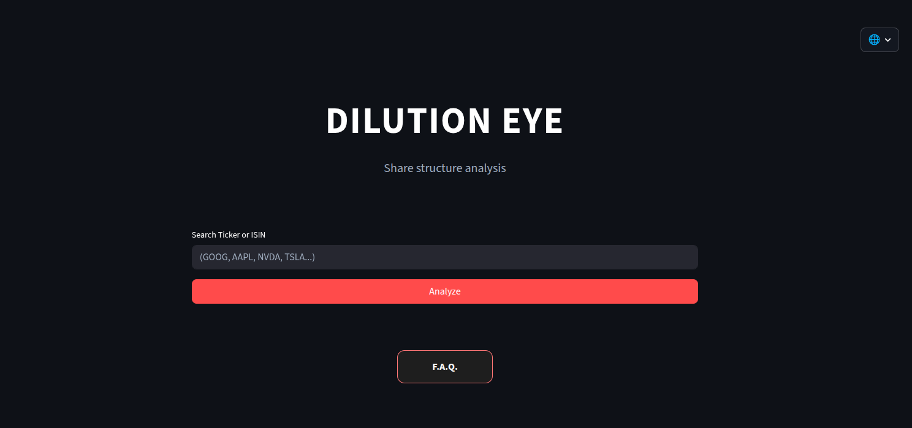
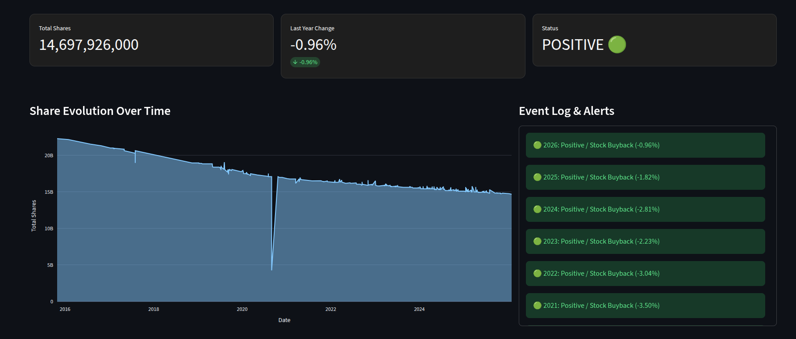
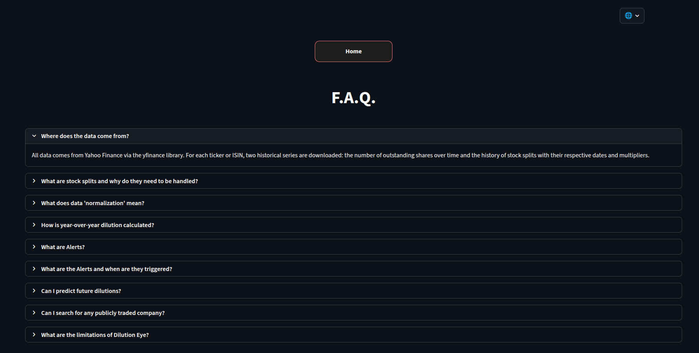

<h1>👁️ Dilution Eye <small> - Share structure analysis</small></h1>

I created this tool to solve a problem: it’s hard to find reliable data on dilution, and when it comes to non-U.S. stocks, free visual tools are simply nowhere to be found

## The Problem
Analyzing a company’s share structure is a laborious and time-consuming process. Investors typically have to manually sift through years of financial statements to determine whether a company is increasing shareholder value through share buybacks or eroding it (such as through dilution).

Most professional tools for tracking dilution rely exclusively on SEC filings, which means they cover only U.S.-listed companies. For investors looking at European or international markets, there is a significant lack of fast solutions.

## The Solution
Dilution Eye offers a fast and intuitive dashboard powered by **Yahoo Finance**. It automates data retrieval for companies listed on major stock exchanges across the globe, so investors can track how any stock's share count evolved over the years in seconds. To ensure accuracy, all historical data is retroactively adjusted for stock splits, enabling precise comparisons.

## How It Works

* **1 - Data retrieval:** Using the `yfinance` API, the app retrieves historical data on shares outstanding and the complete history of stock splits for the selected ticker or ISIN.
* **2 - Vectorized normalization:** To solve the Split Distortion problem, the algorithm uses the `pandas` library to identify each stock split event and retroactively calculate the adjusted number of shares for all previous dates.
* **3 - Year-over-year metrics:** Once the data is normalized, the app resamples the number of shares at the end of each fiscal year and calculates the net percentage change to highlight periods of buyback or dilution.

## Web App

*Figure 1: Dashboard overview.*

* **Global Ticker & ISIN Support:** Search for any stock listed on Yahoo Finance, from NASDAQ giants to European small-caps.

*Figure 2: Analysis of Apple (AAPL).*

* **Interactive Visualizations:** Powered by `plotly`, the app renders dynamic area charts showing the evolution of adjusted shares over time.
* **Financial Health Status:** A real-time KPI categorizing the stock's trend (🟢 Positive, ⚪ Stable, 🟡 Warning, 🚩 Diluting).

*Figure 3: F.A.Q. page.*

## Disclaimer

Dilution Eye is an educational and informational tool only. The data and analysis provided do not constitute financial, investment, or legal advice. Information accuracy depends entirely on Yahoo Finance and is not guaranteed. The author assumes no responsibility for any financial losses or decisions made based on this data. Always perform your own due diligence.

## Privacy
Dilution Eye does not track IP addresses, personal data, or geolocation. For debugging purposes and to optimize performance, the system records only the text entered into the search bar and the query result (Success/Error). These logs are private and accessible only to the developer.

## License
This project is licensed under the **MIT License** - see the [LICENSE](LICENSE) file for details.